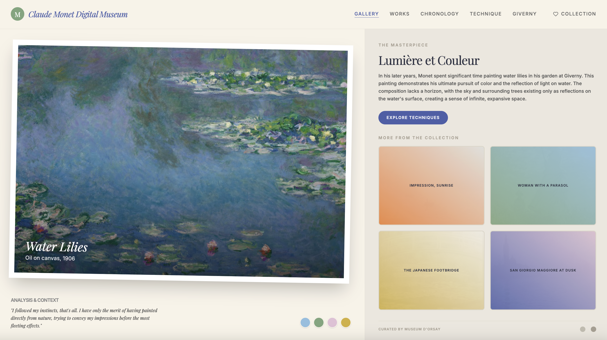
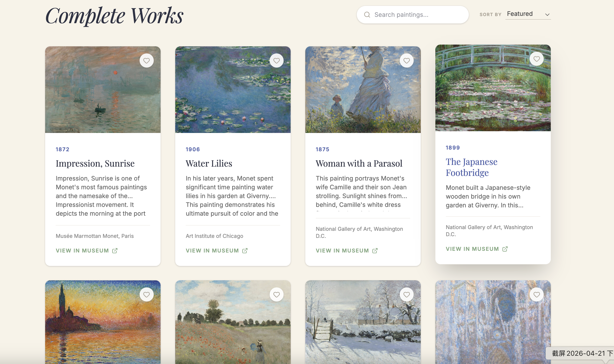
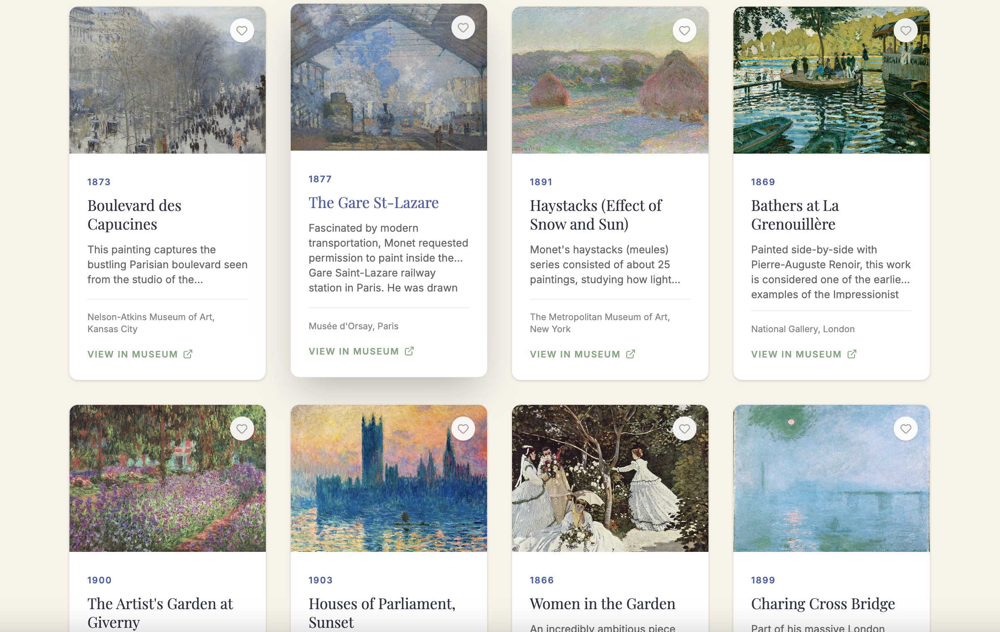

  
  
  <h1 align="center">Claude Monet Digital Museum</h1>

  

    An immersive, elegant, and interactive digital gallery celebrating the life and works of the founder of Impressionist painting, Oscar-Claude Monet.
     
     
    <a href="https://claude-monet-eight.vercel.app/"><strong>Explore the Live Application »</strong></a>
     
     
  

## 🎨 Overview

The **Claude Monet Digital Museum** is a carefully crafted web application designed to bring the breathtaking beauty and historical significance of Monet's artwork to the digital medium. Built with a focus on typography, whitespace, and fluid interactions, this application offers an educational and aesthetic journey through the legacy of defining French Impressionism.

## ✨ Features

- 🖼️ **Curated Gallery & Complete Works**
  - Explore over 30+ meticulously cataloged masterpieces.
  - Interactive grid view with subtle hover animations and lazy-loaded imagery.
  - Search by painting title, location, or year.
  - Sort functions (Oldest First, Newest First, Featured).

- 🔍 **Interactive Lightbox Experience**
  - Click on any artwork to expand it into a beautiful, distraction-free fullscreen lightbox.
  - View detailed historical contexts, dimensions, and current exhibition locations.
  - Direct links out to official museum collections (Metropolitan Museum of Art, Art Institute of Chicago, Musée d'Orsay, etc.).

- 🕰️ **Thematic Exhibitions**
  - **Chronology**: An interactive timeline detailing the vital eras of Monet's life, from his early years in Le Havre to his final days in Giverny.
  - **Technique**: Explore the revolutionary "En plein air" methodology, his studies of light, and his distinctive color palettes.
  - **Giverny Focus**: A dedicated section delving into the lush water lily pond and Japanese bridge that inspired his later monumental works.

- ❤️ **Personal Collection (Favorites)**
  - Curate your own personal exhibition.
  - Save your favorite paintings seamlessly.
  - Relies on local storage for data persistence—your collection waits for you when you return.

- 📱 **Fully Responsive Design**
  - A mobile-first, desktop-optimized fluid UI that scales elegantly across phones, tablets, and ultra-wide monitor displays.

## 🛠️ Tech Stack

This project leverages modern frontend technologies for maximum performance and maintainability:

- **Framework**: [React 18](https://react.dev/)
- **Build Tool**: [Vite](https://vitejs.dev/)
- **Language**: [TypeScript](https://www.typescriptlang.org/)
- **Styling**: [Tailwind CSS v4](https://tailwindcss.com/)
- **Animation**: [Motion (Framer Motion)](https://motion.dev/)
- **Icons**: [Lucide React](https://lucide.dev/)

## 📄 License & Copyright

All painting images are sourced from the public domain or open-access museum APIs (e.g., Wikimedia Commons, The Met Open Access, Art Institute of Chicago Public Domain).

&copy; Copyright Yuyao Wang | [yuyaow@bu.edu](mailto:yuyaow@bu.edu)

*“Everyone discusses my art and pretends to understand, as if it were necessary to understand, when it is simply necessary to love.”* — **Claude Monet**
